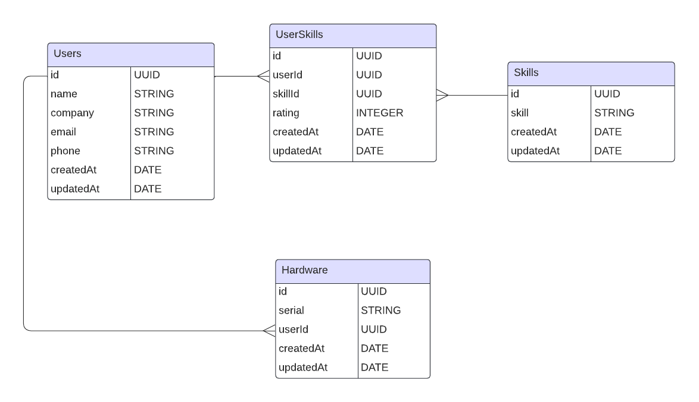

# Project Overview
This is my submission for the [Hack The North 2024 Backend Challenge](https://gist.github.com/DanielYu842/ac519f42477cbf7ec7871321bd0b900e). As a bonus, I also included the capability to check out and return hardware in this API, adding an additional hardware table into the database and hardware endpoints!

The app uses the following tech stack:
- SQLite
- Sequelize ORM
- Express
- Node
- Docker

<br/>

# Database Schema


#### <b>Why did I use a many-to-many relationship between users and skills?</b>
I recognized that users can possess multiple skills, and skills can be shared among multiple users. As such, using a many-to-many relationship helps avoid data redundancy. The users and skills are only stored once in their respective tables, while the association between them is managed through the `UserSkills` junction table.

This also decouples the concerns of users, skills, and their associations in separate tables. For example, when I want to update Breanna Dillon's Python rating, I can modify that association in the `UserSkills` table without affecting the data in the `Users` or `Skills` table.

#### <b>Why did I use a one-to-many relationship between users and hardware?</b>
I recognized that users can borrow multiple hardware. However, unlike skills, I assumed a piece of hardware can only be owned by one user at a time. As such, I used a one-to-many relationship between users and hardware, where there is a foreign key relationship between the `Users` table's `id` column and the `Hardware` table's `userId` column. Altogether, this ensures that each piece of hardware is associated with only one user and prevents conflicts in hardware ownership.


# Development
#### <b> Why did I choose to split the application logic into routes, controllers, and services?</b>
I modularized the app into routes, controllers, and services to create a flexible app architecture. By separating these concerns, I can easily modify individual parts of the API without affecting the entire system. 

For example, if I want to refine the request-handling logic of an endpoint to catch more invalid requests, I can modify the corresponding controller. Similarly, if I want to change the core logic of how we update users, I can edit the corresponding function in the UserService.

Also, modularizing the app would allow for more focused testing. Unit tests can be developed to target specifically controllers, services, etc. (Assume that tests would be developed in the future, I ran out of time to create tests for now 🤡).

#### <b>Why did I choose to use Sequelize?</b>
I used Sequelize as an ORM in this app because it abstracted away the need to write raw SQL when interacting with the database. For example, Sequelize provides a migration feature that allows me to define the database using Javascript files (instead of needing to manually run SQL scripts).

Additionally, I used Sequelize because of its protection against SQL injections. This is because Sequelize lets me pass in users' inputs as data parameters, while escaping special characters to prevent the execution of SQL code that could be injected by attackers.

# API Documentation
<b>Get all users</b><br/>
`GET /users/`<br/>
<i>Returns `name`, `company`, `email`, `phone`, `skills`, and `hardware` information for all users.</i><br/>
Sample Response:
```
[
    {
        "id": "d19c7a40-1472-45c6-a28c-2638d1221c58",
        "name": "Breanna Dillon",
        "company": "Jackson Ltd",
        "email": "lorettabrown@example.net",
        "phone": "+1-924-116-7963",
        "skills": [
            {
                "skill": "Swift",
                "rating": 4
            },
            {
                "skill": "OpenCV",
                "rating": 1
            }
        ],
        "hardware": [
            {
                "serial": "H0001"
            },
            {
                "serial": "H0002"
            }
        ]
    },
    ...
]
```
<br/>

<b>Get user by id</b><br/>
`GET /users/:id`<br/>
<i>Returns `name`, `company`, `email`, `phone`, `skills`, and `hardware` information for a specific user by their `id`.<br/>
Throws a Bad Request if the input is an invalid UUID.<br/>
Throws an error if no user is found with that `id`.</i><br/>
Sample Response:
```
{
    "id": "576e0d5f-ebec-4cb0-b54b-1cbbb418b28d",
    "name": "Andrew Stark",
    "company": "Barry Group",
    "email": "wrobinson@example.org",
    "phone": "336.286.5914",
    "skills": [
        {
            "skill": "Sed",
            "rating": 3
        },
        {
            "skill": "Smalltalk",
            "rating": 3
        }
    ],
    "hardware": [
        {
            "serial": "H0003"
        },
        {
            "serial": "H0004"
        }
    ]
}
```
<br/>

<b>Update user</b><br/>
`PATCH /users/:id`<br/>
<i>Updates an existing user's information.<br/>
Throws a Bad Request if the payload is empty/contains fields other than `name`, `company`, `email`, `phone` and/or `skills`.<br/>
Skills that do not exist in the `Skills` table will not be added.</i><br/>
Sample Body:
```
{
    "name": "Joe Biden",
    "company": "Google",
    "skills": [
        {
            "skill": "Sed",
            "rating": 5
        },
        {
            "skill": "Swift",
            "rating": 10
        }
    ]
}
```

Sample Response:
```
{
    "id": "576e0d5f-ebec-4cb0-b54b-1cbbb418b28d",
    "name": "Joe Biden",
    "company": "Google",
    "email": "wrobinson@example.org",
    "phone": "336.286.5914",
    "skills": [
        {
            "skill": "Sed",
            "rating": 5
        },
        {
            "skill": "Smalltalk",
            "rating": 3
        },
        {
            "skill": "Swift",
            "rating": 10
        }
    ],
    "hardware": [
        {
            "serial": "H0003"
        },
        {
            "serial": "H0004"
        }
    ]
}
```
<br/>

<b>Get skills</b><br/>
`GET /skills/?min_frequency=30&max_frequency=50`<br/>
<i>Returns skills with frequencies ranging from `min_frequency` to `max_frequency`, inclusive.<br/>
Throws a Bad Request if an empty/invalid `min_frequency` or `max_frequency` is provided.</i><br/>
Sample Response:
```
[
    {
        "skill": "Common Lisp",
        "frequency": 34
    },
    {
        "skill": "Sanic",
        "frequency": 43
    },
    {
        "skill": "SQL",
        "frequency": 32
    },
    {
        "skill": "Bokeh",
        "frequency": 30
    },
    ...
]
```
<br/>

<b>Get hardware</b><br/>
`GET /hardwares/`<br/>
<i>Returns `serial` and owner name information for all hardware.</i><br/>
Sample Response:
```
[
    {
        "serial": "H0001",
        "owner": "Breanna Dillon"
    },
    {
        "serial": "H0002",
        "owner": "Breanna Dillon"
    },
   {
        "serial": "H0003",
        "owner": "Joe Biden"
    },
    {
        "serial": "H0004",
        "owner": "Joe Biden"
    },
    ...
]
```
<br/>

<b>Get hardware owned by user</b><br/>
`GET /hardwares/:id`<br/>
<i>Returns serials of hardware owned by a specific user by their `id`.<br/>
Throws a Bad Request if the input is an invalid UUID.<br/>
Throws an error if no user is found with that `id`.</i><br/>
Sample Response:
```
[
    {
        "serial": "H0003",
        "owner": "Joe Biden"
    },
    {
        "serial": "H0004",
        "owner": "Joe Biden"
    }
]
```
<br/>

<b>Check out hardware</b><br/>
`POST /hardwares/:id`<br/>
<i>Creates hardware and assigns it to user by their `id`.<br/>
Throws a Bad Request if the payload is empty/contains fields other than `serial`.<br/>
Will not check out if the hardware `serial` is already owned by a user.</i><br/>
Sample Body:
```
{
    "serial": "H0005"
}
```
Sample Response:
```
{
    "id": "bc5ecf2a-b405-45a5-87de-91990b3b4449",
    "serial": "H0005",
    "userId": "576e0d5f-ebec-4cb0-b54b-1cbbb418b28d",
    "updatedAt": "2024-02-19T22:54:14.554Z",
    "createdAt": "2024-02-19T22:54:14.554Z"
}
```
<br/>

<b>Return hardware</b><br/>
`DELETE /hardwares/`<br/>
<i>Deletes hardware from database.<br/>
Throws a Bad Request if the payload is empty/contains fields other than `serial`.</i><br/>
Sample Body:
```
{
    "serial": "H0005"
}
```
Sample Response:
```
The hardware H0005 has been returned successfully!
```

# Future Roadmap
- Caching mechanisms can be implemented to reduce database load and improve performance. For example, the response for getting all users' informations could be cached to avoid querying the database every time. We could define a caching strategy that refreshes the cache if the API updates a user, checks out hardware, or returns hardware.
- Unit tests for the individual services could be helpful, so that we can test their logic and edge cases. Integration and e2e tests could also be implemented to make sure components (e.g. controllers, services) are working together and the overall app is functioning as expected.

Thanks for taking the time to review this submission, appreciate it 🙏,
